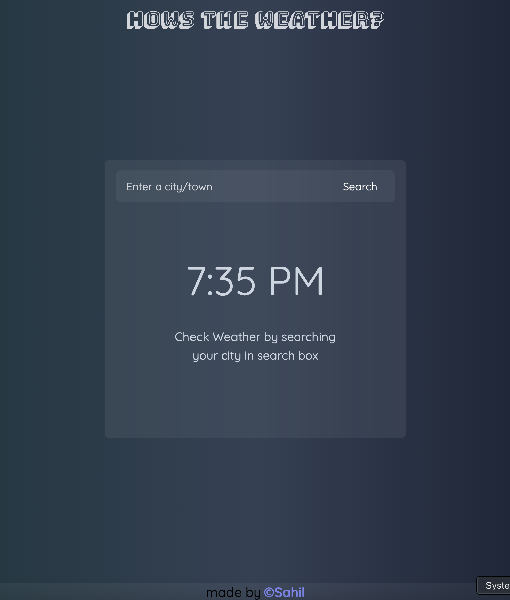
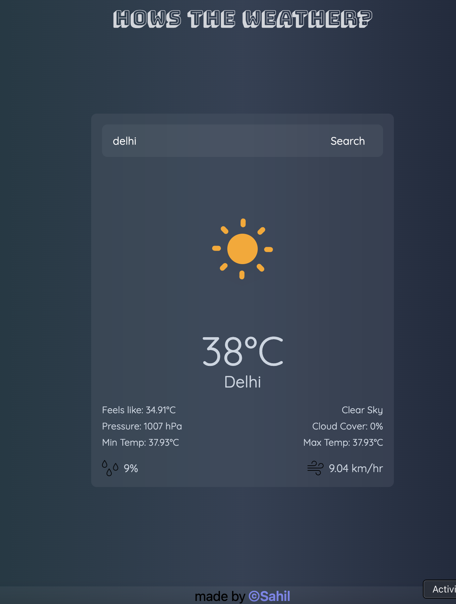

# How is the Weather? 

[](https://wakatime.com/badge/user/018dc268-cd1f-405a-abd9-12f1bce09a2f/project/018e192c-a5f4-4bc9-bea6-4e4a2b797517)

A sleek, responsive weather application built with **React**, **TailwindCSS**, and **Express.js**, hosted on **Vercel**.

🔗 Live App: [howistheweather.vercel.app](https://howistheweather.vercel.app)

---

## 🌟 Features

- 🌍 Search weather by city or town
- 🌤️ Weather icons based on real-time conditions
- 🌡️ Displays temperature, pressure, humidity, wind speed, etc.
- 💬 User-friendly error handling with toast notifications
- 🎨 Smooth UI with Tailwind CSS and blur effects

---

## ⚙️ Tech Stack

- **Frontend:** React, Vite, TailwindCSS
- **Backend:** Node.js, Express.js
- **APIs:** OpenWeatherMap API
- **Deployment:** Vercel (Frontend), Render (Backend)

---

## 🚀 Getting Started

### 1. Clone the repo
```bash
git clone https://github.com/sahiwl/howistheweather.git
cd howistheweather
```

### 2. Install dependencies
```bash
npm install
```

### 3. Set up environment variables
Create a `.env` file and add:
```env
VITE_BE_URL=https://your-backend-url.com
```

### 4. Run the app locally
```bash
npm run dev
```


## 📸 Screenshots
| Search Page | Weather Info |
|-------------|---------------|
|  |  |

---

## 🧠 Learnings
- How to work with REST APIs and fetch async data
- Improved state and error handling
- Configuring CORS and proxy setups
- Deploying full-stack projects on Vercel and Render


## 🙏 Credits
- Data from [OpenWeatherMap](https://openweathermap.org/)

---